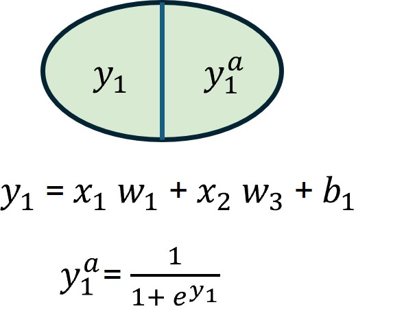

# Derivatives

Derivatives are an important component of understanding how neural networks work because they are used in backpropagation to adjust neuron weights to minimize the loss function. 

A derivative is the slope or rate of change of a function at a certain point. The slope of the line is such that it is tangent to the function at that point. Mathematically, this is:

$$
f'(x) = \lim_{h \to 0} \frac{f(x + h) - f(x)}{h}
$$

So if we have a function $f(x) = 3x^2 + 4x + 6$ and we want to approximate the derivate at $x=2$, we would choose an h close to 0 such as $h=0.0001$.

$$
\frac{3(2+0.0001)^2 + 4(2 + 0.0001) + 6 - 3(2)^2 + 4(2) + 6}{0.0001} \approx 16
$$

So by using the approximation from limits we have $f'(2) = 16$. We can also use knowledge of calculus to know that in this case $f'(x) = 6x + 4$ and if we evaluate that we get the same outcome $f'(2) = 16$. 

# Chain Rule

The chain rule is used to take the derivative of a composite function. This is a key concept in backpropagation because a neural network is essentially a composition of interconnected functions. So in order to minimize the loss function we have to take the derivative of the network function. 

The chain rule is defined using these rules: 

If $y = f(u)$ and $u = g(x)$ then $\frac{dy}{dx} = \frac{dy}{du} \frac{du}{dx}$

This means that if we have a function $f(x) = x^7$ and another function $g(x) = 4*x^2 + 5*x + 6$ where $f(g(x)) = (4*x^2 + 5*x + 6)^7$

Then $f'(g(x)) = f'(u) * g'(x) = 7u^6 * (8x + 5) = 7(4*x^2 + 5*x + 6)^6 * (8x + 5)$

Note here that we only composed two functions but we can comose any number of functions (e.g $f(g(h(c(b))))$) 

# Network Mechanics

## Forward Pass

Ok now lets suppose we have a simple network with one hidden layer. A hidden layer is just a series of neurons that is in between the input layer on the far left hand side and the output layer on the far right hand side. An example of such a network is show below: 

Neural networks use something call an activation function to keep values of neurons bounded. The input from $y_1$ gets passed to the activation function and the output from the activation function gets pass to the next layer in the network. There are different activation functions available for use the one we are going to use in this example is the logistic activation function and it looks like this: 

$$
f(x) = \frac{1}{1+e^{-x}}
$$

So now that we have the structure of the network and how to calculate the value of each neuron we have the following:

---

$$y_1 = x_1 w_1 + x_2 w_3 + c_1$$

$$y_1^a = \frac{1}{1+e^{-y_1}}$$

$$y_2 = x_1 w_2 + x_2 w_4 + c_1$$

$$y_2^a = \frac{1}{1+e^{-y_2}}$$

---

$$z_1 = y_1^a w_5 + y_2^a w_7 + c_2$$

$$z_1^a = \frac{1}{1+e^{-z_1}}$$

$$z_2 = y_1^a w_6 + y_2^a w_8 + c_2$$

$$z_2^a = \frac{1}{1+e^{-z_2}}$$

---

To evaluate the performance of the network and how well it it modeling the training data we also need an error function. The one we will use here is the squared error function. It calculate the error across all the neurons in the output layer and it looks like this: 

$$
E_Total = \sum_{i=1}^{2} \frac{1}{2}(target - z_i^a)^2
$$

For out network we would calculate the error using:

$$
E_Total = E_1 + E_2
$$

Where: 

$$
E_1 = \frac{1}{2}(target - z_1^a)^2
$$

and 

$$
E_2 = \frac{1}{2}(target - z_2^a)^2
$$

Now if we suppose we have the following inputs and weights:  

| Variable   | Value  |
|------------|--------|
| $x_1$      | 0.5    |
| $x_2$      | 0.1    |
| $w_1$      | 0.15   |
| $w_2$      | 0.2    |
| $w_3$      | 0.25   |
| $w_4$      | 0.3    |
| $w_5$      | 0.4    |
| $w_6$      | 0.45   |
| $w_7$      | 0.5    |
| $w_8$      | 0.55   |
| $c_1$      | 0.35   |
| $c_1$      | 0.60   |

And the desired outputs (the targets): 

| Variable   | Value  |
|------------|--------|
| $z_1$      | 0.1    |
| $z_2$      | 0.99   |

Then after our first forward pass we have: 

| Variable   | Value  |
|------------|--------|
| $y_1$      |   0.3825  |
| $y_1^a$    |  0.4055  |
| $y_2$      |   0.39  |
| $y_2^a$    |  0.4037  |
| $z_1$      |   0.96405  |
| $z_1^a$    |  0.2761  |
| $z_2$      |   1.00451  |
| $z_2^a$    |  0.2681  |

And the corresponding error:

| Variable   | Value  |
|------------|--------|
| $E_{z_1}$      | 0.0155    |
| $E_{z_2}$      | 0.2605   |
| $E_Total$      | 0.2760   |

## Backward Pass 

Ok so we pushed some data through our network transformed it into an output with a total error ($E_Total$) of 0.2760. But how can we make our prediction better (e.g. lower $E_Total$)? That is where backpropagation comes into play. At its core backpropagation looks at the weights in the network and tries to figure out how much they contribute to the overall error. It asks if I were to change this weight, how much would the error change. 

Ok sounds simple enough but how can we accomplish this. With derivatives, which gives us the rate of change of a dependent variable with respect to some independent variable. In this case the independent variables are the weights between the nodes and the dependent variable is the total error ($E_Total$).

Keep in mind that when backpropagating through the network we will also need to to know the derivative of the logarithmic function which looks like this: 

$$
f'(x) = f(x) (1 - f(x)) = \frac{e^{-x}}{(1+e^{-x})^2}
$$

Starting with $z_1$ we need to derive $\frac{dE_total}{dw_5}$ and to do this we need to take into consideration the derivative of the intermediate functions between $w_5$ and the error in the out put. In this case, because $w_5$ only influences $E_1$ this means $\frac{dE_total}{dw_5} = \frac{dE_1}{dw_5}$ which will simplify the derivation slightly. Via the **chain rule** we have:

$$
\frac{dE_1}{dw_5} = \frac{dE_1}{dz_1^a} * \frac{dz_1^a}{dz_1} * \frac{dz_1}{dw_5}
$$

With our knowledge that:

$$
E_1 = \frac{1}{2}(target_1 - z_1^a)^2
$$

We can calculate the derivative as:

$$
\frac{dE_1}{dz_1^a} = 2 * \frac{1}{2}(target_1 - z_1^a)^{2-1} * (0 - 1) = z_1^a - target_1
$$

Next for $z_1^a$ we know that: 

$$z_1^a = \frac{1}{1+e^{-z_1}}$$

So we can calculate the derivative as:

$$
\frac{dz_1^a}{dz_1} = z_1^a (1 - z_1^a) = \frac{1}{1+e^{-z_1}} (1 - \frac{1}{1+e^{-z_1}}) = \frac{e^{-z_1}}{(1+e^{-z_1})^2}
$$

and finally we know that 

$$z_1 = y_1^a w_5 + y_2^a w_7 + c_2$$

So

$$
\frac{dz_1}{dw_5} = y_1^a
$$

Put it all together and you have derived the rate of change of $E_1$ with respect to $w_5$:

$$
\frac{dE_1}{dw_5} = \frac{dE_1}{dz_1^a} * \frac{dz_1^a}{dz_1} * \frac{dz_1}{dw_5} = (z_1^a - target_1) * (z_1^a (1 - z_1^a)) * (y_1^a)
$$

Also by definition, when adjusting the weights in our network we adjust the weight by $\frac{dE_T}{dw_i}$ time the leaning rate ($\eta$), so: 

$$
w_5^{+} = w_5 - \eta * \frac{dE_1}{dw_5}
$$

---

Ok now moving to $z_2$, we need to derive $\frac{dE_total}{dw_8}$ and to do this we need to take into consideration the derivative of the intermediate functions between $w_8$ and the error in the output. In this case, because $w_8$ only influences $E_2$ this means $\frac{dE_total}{dw_8} = \frac{dE_2}{dw_8}$ which will simplify the derivation slightly. Via the **chain rule** we have:

$$
\frac{dE_2}{dw_8} = \frac{dE_2}{dz_2^a} * \frac{dz_2^a}{dz_2} * \frac{dz_2}{dw_8}
$$

With our knowledge that:

$$
E_2 = \frac{1}{2}(target_2 - z_2^a)^2
$$

We can calculate the derivative as:

$$
\frac{dE_2}{dz_2^a} = 2 * \frac{1}{2}(target_2 - z_2^a)^{2-1} * (0 - 1) = z_2^a - target_2
$$

Next for $z_2^a$ we know that: 

$$z_2^a = \frac{1}{1+e^{-z_2}}$$

So we can calculate the derivative as:

$$
\frac{dz_2^a}{dz_2} = z_2^a (1 - z_2^a) = \frac{1}{1+e^{-z_2}} (1 - \frac{1}{1+e^{-z_2}}) = \frac{e^{-z_2}}{(1+e^{-z_2})^2}
$$

and finally we know that 

$$z_2 = y_1^a w_6 + y_2^a w_8 + c_2$$

So

$$
\frac{dz_2}{dw_8} = y_2^a
$$

Put it all together and you have derived the rate of change of $E_2$ with respect to $w_8$:

$$
\frac{dE_2}{dw_8} = \frac{dE_2}{dz_2^a} * \frac{dz_2^a}{dz_2} * \frac{dz_2}{dw_8} = (z_2^a - target_2) * (z_2^a (1 - z_2^a)) * (y_2^a)
$$

Also by definition, when adjusting the weights in our network we adjust the weight by $\frac{dE_T}{dw_i}$ time the leaning rate ($\eta$), so: 

$$
w_8^{+} = w_8 - \eta * \frac{dE_2}{dw_8}
$$

---

*Derivation  of $w_6^+$ and $w_7^+$ excluded because derivation is redundant*

---

Ok so now we have adjusted the first weights in our network and we continue backpropagation through to the next node $y_1$ and weight $w_1$. This time things are a bit more complex because the change of weight of $w_1$ and subsequently the output from $y_1$ affects both $E_1$ and $E_2$. 

Similar to before we have:

$$
\frac{dE_T}{dw_1} = \frac{dE_T}{dy_1^a} * \frac{dy_1^a}{dy_1} * \frac{dy_1}{dw_1}
$$

But the tricky part comes from deriving what $\frac{dE_T}{dy_1^a}$ is because it depends of how $y_1^a$ changes the value of ${dE_1}$ and ${dE_2}$, mathematically this gives: 

$$
\frac{dE_T}{dy_1^a} = \frac{dE_1}{dy_1^a} + \frac{dE_2}{dy_1^a}
$$

Starting with $\frac{dE_1}{dy_1^a}$ we need to associate the change in $y_1^a$ with the associated changes in $z_1$:

$$
\frac{dE_1}{dy_1^a} = \frac{dE_1}{dz_1^a} * \frac{dz_1^a}{dz_1} * \frac{dz_1}{dy_1^a}
$$

The good news is that we already know the value of $\frac{dE_1}{dz_1^a}$ and $\frac{dz_1^a}{dz_1}$ are from previous derivations so we just need to find $\frac{dz_1}{dy_1^a}$ and we know that: 

$$z_1 = y_1^a w_5 + y_2^a w_7 + c_2$$

So:

$$
frac{dz_1}{dy_1^a} = w_5
$$

Next we need to figure out what $\frac{dE_2}{dy_1^a}$ is and to do that we need to associate the change in $y_1^a$ with the associated changes in $z_2$:

$$
\frac{dE_2}{dy_1^a} = \frac{dE_2}{dz_1^a} * \frac{dz_2^a}{dz_2} * \frac{dz_2}{dy_1^a}
$$

The good news is that we already know the value of $\frac{dE_2}{dz_2^a}$ and $\frac{dz_2^a}{dz_2}$ are from previous derivations so we just need to find $\frac{dz_2}{dy_1^a}$ and we know that: 

$$z_1 = y_1^a w_6 + y_2^a w_8 + c_2$$

So:

$$
\frac{dz_2}{dy_1^a} = w_6
$$

Now we have all the information we need to calculate $\frac{dE_T}{dy_1^a}$. The last step is to calculate $\frac{dy_1^a}{dy_1}$ and $\frac{dy_1}{dw_1}$ which is straight forward. 

We know

$$y_1^a = \frac{1}{1+e^{-y_1}}$$

So: 

$$
\frac{dy_1^a}{dy_1} = y_1^a (1 - y_1^a) = \frac{1}{1+e^{-y_1}} (1 - \frac{1}{1+e^{-y_1}})
$$

And finally we know that 

$$y_1 = x_1 w_1 + x_2 w_3 + c_1$$

So 

$$
\frac{dy_1}{dw_1} = x_1
$$

Put it all together and we have:

$$
\frac{dE_T}{dw_1} = \frac{dE_T}{dy_1^a} * \frac{dy_1^a}{dy_1} * \frac{dy_1}{dw_1} \\
$$

$$
= (\frac{dE_1}{dy_1^a} + \frac{dE_2}{dy_1^a}) * \frac{dy_1^a}{dy_1} * \frac{dy_1}{dw_1} \\
$$

$$
= ((\frac{dE_1}{dz_1^a} * \frac{dz_1^a}{dz_1} * \frac{dz_1}{dy_1^a}) + (\frac{dE_2}{dz_1^a} * \frac{dz_2^a}{dz_2} * \frac{dz_2}{dy_1^a})) * y_1^a (1 - y_1^a) * x_1 \\
$$

And finally we adjust the weight of $w_1$ as:

$$
w_1^{+} = w_1 - \eta * \frac{dE_t}{dw_1}
$$

---

*Derivation  of $w_2^+$, $w_3^+$, and $w_4^+$ excluded because derivation is redundant*

---

# Closing

Ok we made it, we learned the math behind how a small and simple neural network is trained by iteratively adjusting the weights! This was only one iteration, in reality training can take many iterations. There is a lot of work that goes into even this simple network. Doing all this by hand makes it much clearer as to why large networks require weeks to train and cost millions of dollars to build from scratch. 

Luckily going forward we will have the computer do all the work. 

Note: This guide was adopted from [A Step by Step Backpropagation Example](https://mattmazur.com/2015/03/17/a-step-by-step-backpropagation-example/).

# Resources
- [Derivative](https://www.britannica.com/science/derivative-mathematics)
- [What is the derivative of the logistic sigmoid function?](https://sebastianraschka.com/faq/docs/logisic-sigmoid-derivative.html#what-is-the-derivative-of-the-logistic-sigmoid-function)
- [The Chain Rule... How? When? (NancyPi)](https://youtu.be/H-ybCx8gt-8?si=UiXqUyOsEhEY2gWE)
- [A Step by Step Backpropagation Example](https://mattmazur.com/2015/03/17/a-step-by-step-backpropagation-example/)