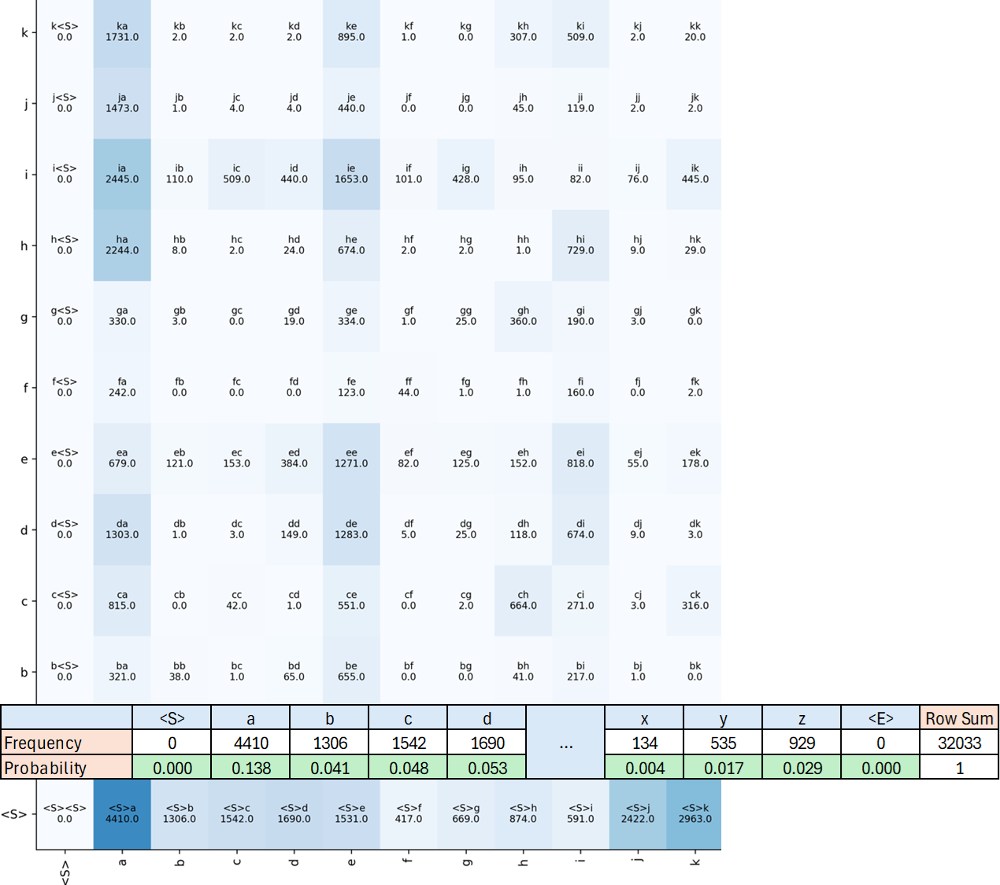

# The Bigram Language Model

Author: Andrew Francis
Genre: Non-Fiction Science
Subject: Computer Science, Neural Networks
Status: In progress
Type: Personal Essay

The bigram language model is as simple as it gets. It has a context window of 1 character. In other words, it makes next character predictions based on a single preceding character. Such a simple mode provides a foundation for how more complex language models operate and are constructed. Plus the model produces some entertaining results. In this article I want to explore how to build a bigram language model that generates a list of unique names using two separate approaches and investigate the results. Approach one uses a table based tabulation approach. Approach two will cover how to approach the same problem using a neural network. 

## Approach 1: Table Based

As with any model, the first thing to gather is data. Really any name dataset will do, [this one](https://www.kaggle.com/datasets/datagov/usa-names) is good. Once you have a dataset of names, the next step in building a bigram model is to determine the frequency (count) that pairs of characters occur in sequence across the dataset. For example, the name Gabe would contribute the following bigram pairs to the dataset: `ga, ab, be` . So you go through the dataset and do that for every name and keep a running count of the number of times a pair of characters occurs together. 

One thing to make note of here is in each word, in addition to the characters, we must keep track of where the beginning and end of a word is. Practically speaking this means each name must be wrapped in a set of special characters that delimit the start from the end, such as `<S>Gabe<E>` . Start is important because when we start querying our model to build a unique name we always sample from the start character probabilities. End is important because it signifies when to terminate name generation and provide the finished name. These special tokens are just treated as extra characters by the model. 

Once you have finished counting characters, you can construct a square matrix containing the frequency of the pairs. Each axis of the matrix contains the characters of the alphabet, where the intersection of each row and column is the frequency of the given pair. Before modeling, we much convert each of the frequency into a probability. This is done by calculating the sum of each row in the frequency matrix and then diving each frequency by the respective row sum. This is illustration in Figure 1. 



Figure 1: Partial bigram frequency matrix given for a database of first names and the start character probability

Once the probability of each pair has been calculated, names can be constructed by sampling from the probability matrix. We sample by beginning in the row of starting characters. We then sample the row by using the starting row probabilities to sample from a multinomial distribution. Basically, the multinomial distribution just allows characters to be drawn from a row in relation to their probability. So if a row had 10% probability of drawing the `ed` bigram, then when sampling the multinominal distribution 10 times we would expect to draw `ed` one time. The character that we sample, determines the next row that we sample from. So if we sample from the “g” column we will then move to sampling the “g” row. The basic premise for this algorithm is as such:

```markup
character = "<S>"
name = ""
while character != "<E>":
	character_probabilities = matrix[character][:]
	character = Mutinomial(character_probabilities , n=1)
	if character != "<E>"
		name += character
```

Figure 2 gives a visual representation of how this process would unfold when building out the name Gabe.


Figure 3: Sampling sequence for construction of the name Gabe

That is it. The model can now generate unique names, that are mostly nonsensical, sometimes funny, and occasionally not bad. Some examples are shown below in Table 1. Personally, I like Minaswila.


Table 1: Names generated by the bigram language model 

The output gives a good qualitative sense of how well the model performs but how can the performance be quantified? Quantification is important to compare performance across different approaches and to benchmark improvements. One way to benchmark performance for categorical classification tasks is to use average negative log likelihood (NLL) across predictions. In this case the lower the value the better, where 0 will indicate perfect predictions. The average NLL is calculated as follows: 


This equation is saying that to calculate the average NLL, we take each bigram in the training set, lookup the probability, take the log of the probability, take the average result across all of the examples in the training set and multiple the result be negative one. Lets look at each step in a bit more detail. 

Each of the values that we look up is going to be between 0 and 1 because we are looking up probability values. Given that we take the log of these probabilities, the resulting values will always be between negative infinity and 0. We take the average across all examples to get a wholistic sense of how the model performs across all the examples. The negative is taken because generally it is preferential to minimize an objective function. This is not relevant for this approach, however, the same objective function is used in the network based approach. 

When looking up each of the bigram pairs we always want the probability to be 1 because this would indicate that we always get the correct prediction for a bigram. However, this is not the case. Whenever, we look up a bigram it is likely that we get a probability other than one. So by taking the NLL we get a sense of how far off the models predicted probability is from the desired probability. For comparison purposes the model in this example produced an average NLL of 2.4541 across all the examples. 

## Approach 2: Network Based

Ok table based is cool. In the bigram scenario where the only context given is the previous character, the table based approach is actually the best that we can hope to do. So why bother with the network based approach? Well in this case it is not necessary because the problem space is so small. There are only 784 possible bigram pairs. However, this approach breaks down as the complexity grows and because very inefficient and unscalable. Consider, a tri-gram model, where there would be 21,952 possible combinations. The problem space grows exponentially as the model incorporates more context. 

We use the network based approach because it is more scalable. So how does it work? We start by breaking up our bigram training data into two arrays containing the first and second characters of the bigram pair, respectively. We then replace each character with the characters index.

Once we have this, we then use one hot encoding to encode the first character array. This will create an array of vectors that each have 28 elements. The vectors receive a 1 at the index corresponding to the index of there character and a 0 at every other index. Now we have a matrix of values with a shape of [N Examples, 28]. 

Next we have to decide on a network architecture. Starting with the input layer, we start with 28 input nodes. Each will receive and element from the one hot encoded character index vector. Next lets think about the output layer. This layer must also have 28 nodes because the network is trying to predict 1 of the 28 available characters. As we will see it will do this by assigning probabilities to each of the output nodes and then sampling from them as we did in the table based approach. Ok what about the middle, do we need a hidden layer? No probably not, for such a simple problem with such small context we should be able to accurately model the process with only an input and output layer with weights in the middle. 

So what is the shape of the weights matrix, how many weights do we need? Since our input vector is [1, 28], our output vector is [1, 28], and the network is fully connected we need a weight matrix with 28^2 = 784 weights. The shape is determined by matrix multiplication rules. The input vector is [1, 28], and the inner dimensions of matrices being multiplied together must be equal,  so the first dimension of the matrix must be 28 (rows). Now we know that the outer dimension must be 28 to give us the desired number of weights. See figure below for an intuition into how matrix multiplication rules work and how they relate to a neural network. 


Now that the inputs are encoded and the architecture is set, it is time to train the network. So first we perform the forward pass, which just involved multiplying the one hot encoded vector by the weights matrix. This gives a raw output that can be any number, positive or negative. However, we want probabilities. How do we get numbers between 0 and 1 to represent output character probabilities? Enter the SoftMax function. 

The SoftMax function is commonly used in multiclass classification tasks to give probability like outputs. It gives the output two important properties. It ensures the output is always positive by using exponentiation. It also ensures that the output is between 0 and 1 by normalizing the output by dividing everything by the sum of the exponentiated outputs.


The final step is to calculate the loss using our new friend, negative log likelihood (NLL). Here we reintroduce the second character array to compare the network output to the desired output. To do this we take the index of the correct output character from the second character array and pull the probability from the corresponding index in the output vector. Take the negative log of this probability and it gives the NLL. After this we perform backpropagation and adjust the weights in the network proportional to their gradients after backpropagation. We do this over several cycles, or epochs, until the average NLL across the training set starts to change very little. This process is demonstrated in the pseudocode below. 

```markup
n_chars:int # Number of characters/catregories in training set (e.g. 28)

first_char_indexs:list[int] # Index of the first character in bigram pair
next_char_indexs = list[int] # Index of the second character in bigram pair

# Use one-hot encoding to transform character indexes into (1 x n_chars) vectors
# Number of vectors is equal to number of bigrams in training set
first_char_encoded = OneHotEncode(first_char_indexs, num_classes=n_chars)

# Initialize network weights using standard normal distribution
weights = RandomNormal(n_chars, n_chars)

for epoch in epochs:
	log_counts = first_char_encoded x weights
	probs = SoftMax(log_counts)
	
	# Calculate loss
	loss = NegativeLogLikelihood(prob, next_char_indexs)
	
	# Backpropogate loss through network and caclulate gradients
	loss.backward()
	
	# Ajust weights to perform gradient decent
	weights = weights **+** (-learning_rate * weights.grad)
```

Now that we have minimized the loss function using gradient decent we have a matrix of trained weights. This matrix can be used to make predictions and to build names. The process is essentially identical to the process followed in approach one. The process starts by one hot encoding the start character. We multiply this the by the matrix of trained weights and apply the SoftMax function. This give a vector of probabilities. We use the output probabilities to sample from the multinomial distribution, which give the prediction of the index of the next character in the predicted name. We one hot encode the predicted next character and repeat this process until we sample the end token. The process is outlined in pseudocode below. 

```markup
encoded_char = OneHotEncode("<S>")
name = ""
while True:
    log_counts = encoded_char x trained_weights
    char_probs = SoftMax(log_counts)
    predicted_char = Multinomial(char_probs, num_samples=1)

    if predicted_char == <E>:
        break

    encoded_char = OneHotEncode(predicted_char)
    name = name + predicted_char
```

The final thing to address is how does the network approach differ from the table based approach? Basically the answer is that *it does not differ at all*. Everything is exactly the same. The predicted names are the same and the average NLL is also the same (2.4541). One interesting this is that during training the loss in the network approaches the loss found in the table based approach. That makes sense. As mentioned previously the loss and the predictions given in the table based approach are the best possible predictions the model can make with the given information. The model cannot do any better. So when using gradient decent the loss must approach this value.


## Conclusion

So who cares? This model is really simple and useless. That is all true but it portrays something fundamental about how language models operate on large scales and how they are constructed. Train a model using many examples to let it figure out which pieces of information go together. Then take some input, such as a question, and use it as context for the response that follows. Use it to generate the most probable response. 

This is essentially what is happening with the bigram model on a much simpler scale. Use a dataset of names to determine which characters in names go together. Then use that information to find the next likely character given the previous character. The bigram model provides an important basis for understanding more complex modeling operations.

## Resources

1.  **[Neural Networks: Zero to Hero](https://www.youtube.com/playlist?list=PLAqhIrjkxbuWI23v9cThsA9GvCAUhRvKZ) - Andrej Karpathy
2. [Matrix Multiplication](https://youtu.be/JvIOB2RjeyY?si=XYYEhJEYOpdJGsIb) - Shaina Race 

**This was article was developed based on content that I learned for Andrej Karpathy’s series* [Neural Networks: Zero to Hero](https://www.youtube.com/playlist?list=PLAqhIrjkxbuWI23v9cThsA9GvCAUhRvKZ)*, which is excellent.* 

**This article has a codebase. See* [my Github repository](https://github.com/atfranc2/neural-networks/blob/96a2f726dc9e09d71b575771027944e73e56a24f/3_makemore/main.py) *to see the two approaches in code.*