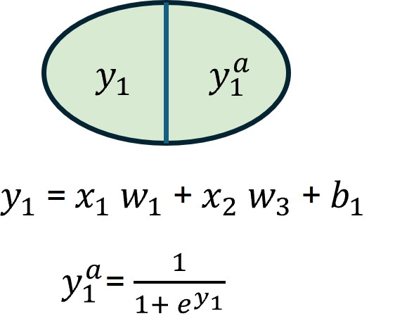

# Derivatives

Derivatives are an important component of understanding how neural networks work because they are used in backpropagation to adjust neuron weights to minimize the loss function. 

A derivative is the slope or rate of change of a function at a certain point. The slope of the line is such that it is tangent to the function at that point. Mathematically, this is:

$$
f'(x) = \lim_{h \to 0} \frac{f(x + h) - f(x)}{h}
$$

So if we have a function $f(x) = 3x^2 + 4x + 6$ and we want to approximate the derivate at $x=2$, we would choose an h close to 0 such as $h=0.0001$.

$$
\frac{3(2+0.0001)^2 + 4(2 + 0.0001) + 6 - 3(2)^2 + 4(2) + 6}{0.0001} \approx 16
$$

So by using the approximation from limits we have $f'(2) = 16$. We can also use knowledge of calculus to know that in this case $f'(x) = 6x + 4$ and if we evaluate that we get the same outcome $f'(2) = 16$. 

# Chain Rule

The chain rule is used to take the derivative of a composite function. This is a key concept in backpropagation because a neural network is essentially a composition of interconnected functions. So in order to minimize the loss function we have to take the derivative of the network function. 

The chain rule is defined using these rules: 

If $y = f(u)$ and $u = g(x)$ then $\frac{dy}{dx} = \frac{dy}{du} \frac{du}{dx}$

This means that if we have a function $f(x) = x^7$ and another function $g(x) = 4*x^2 + 5*x + 6$ where $f(g(x)) = (4*x^2 + 5*x + 6)^7$

Then $f'(g(x)) = f'(u) * g'(x) = 7u^6 * (8x + 5) = 7(4*x^2 + 5*x + 6)^6 * (8x + 5)$

Note here that we only composed two functions but we can comose any number of functions (e.g $f(g(h(c(b))))$) 

# Network Mechanics

## Forward Pass

Ok now lets suppose we have a simple network with one hidden layer. A hidden layer is just a series of neurons that is in between the input layer on the far left hand side and the output layer on the far right hand side. An example of such a network is show below: 

Neural networks use something call an activation function to keep values of neurons bounded. The input from $y_1$ gets passed to the activation function and the output from the activation function gets pass to the next layer in the network. There are different activation functions available for use the one we are going to use in this example is the logistic activation function and it looks like this: 

$$
f(x) = \frac{1}{1+e^-x}
$$

So now that we have the structure of the network and how to calculate the value of each neuron we have the following:

---

$$y_1 = x_1 w_1 + x_2 w_3 + c_1$$

$$y_1^a = \frac{1}{1+e^{y_1}}$$

$$y_2 = x_1 w_2 + x_2 w_4 + c_1$$

$$y_2^a = \frac{1}{1+e^{y_2}}$$

---

$$z_1 = y_1^a w_5 + y_2^a w_7 + c_2$$

$$z_1^a = \frac{1}{1+e^{z_1}}$$

$$z_2 = y_1^a w_6 + y_2^a w_8 + c_2$$

$$z_2^a = \frac{1}{1+e^{z_2}}$$

---

To evaluate the performance of the network and how well it it modeling the training data we also need an error function. The one we will use here is the squared error function. It calculate the error across all the neurons in the output layer and it looks like this: 

$$
E_Total = \sum_{i=1}^{2} \frac{1}{2}(target - z_i)^2
$$

For out network we would calculate the error using:

$$
E_Total = \frac{1}{2}(target - z_1)^2 + \frac{1}{2}(target - z_2)^2
$$

Now if we suppose we have the following inputs and weights: 

| Variable   | Value  |
|------------|--------|
| $x_1$      | 0.5    |
| $x_2$      | 0.1    |
| $w_1$      | 0.15   |
| $w_2$      | 0.2    |
| $w_3$      | 0.25   |
| $w_4$      | 0.3    |
| $w_5$      | 0.4    |
| $w_6$      | 0.45   |
| $w_7$      | 0.5    |
| $w_8$      | 0.55   |
| $c_1$      | 0.35   |
| $c_1$      | 0.60   |

And the desired outputs (the targets): 

| Variable   | Value  |
|------------|--------|
| $z_1$      | 0.1    |
| $z_2$      | 0.99   |

Then after our first forward pass we have: 

| Variable   | Value  |
|------------|--------|
| $y_1$      |   0.3825  |
| $y_1^a$    |  0.4055  |
| $y_2$      |   0.39  |
| $y_2^a$    |  0.4037  |
| $z_1$      |   0.96405  |
| $z_1^a$    |  0.2761  |
| $z_2$      |   1.00451  |
| $z_2^a$    |  0.2681  |

And the corresponding error:

| Variable   | Value  |
|------------|--------|
| $E_{z_1}$      | 0.0155    |
| $E_{z_2}$      | 0.2605   |
| $E_Total$      | 0.2760   |

## Backward Pass 

Ok so we pushed some data through our network transformed it into an output with a total error ($E_Total$) of 0.2760. But how can we make our prediction better (e.g. lower $E_Total$)? That is where backpropagation comes into play. At its core backpropagation looks at the weights in the network and tries to figure out how much they contribute to the overall error. It asks if I were to change this weight, how much would the error change. 

Ok sounds simple enough but how can we accomplish this. With derivatives, which gives us the rate of change of a dependent variable with respect to some independent variable. In this case the independent variables are the weights between the nodes and the dependent variable is the total error ($E_Total$). 

When backpropagating through the network we will also need to to know the derivative of the logarithmic function which looks like this: 

$$
f'(x) = -\frac{e^x}{(1+e^x)^2}
$$

# Resources
- [Derivative Mathematics](https://www.britannica.com/science/derivative-mathematics)
- [Chain Rule Video](https://youtu.be/H-ybCx8gt-8?si=UiXqUyOsEhEY2gWE)
- [Network Mathematics](https://mattmazur.com/2015/03/17/a-step-by-step-backpropagation-example/)